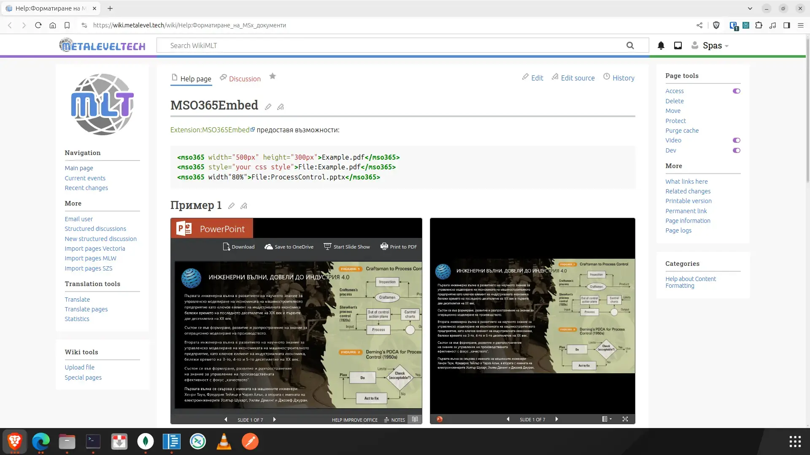

# MediaWiki Extension MSO365Embed



***[The extension is tested with MW 1.40, 1.41](https://wiki.metalevel.tech/wiki/Help:Форматиране_на_MSx_документи)***

MediaWiki media tag extension for embedding of Microsoft Office files, such as "docx", "docm", "xlsx", "xlsm", "pptx", "pptm",  "ppsx" and "ppsm" files by using:

* `https://view.officeapps.live.com/op/embed.aspx?src=...` or
* `https://view.officeapps.live.com/op/view.aspx?src=...`

This extension is based on [Extension:PDFEmbed](https://github.com/WolfgangFahl/PDFEmbed) and is distributed under the same license.

Examples of usage:

```xml
<mso365 width="500px" height="300px">Example.pptx</mso365>
<mso365 style="your css style">File:Example.docx</mso365>
<mso365 action='view'>File:Example.xlsx</mso365>
```

* You can omit the `File:` part. It should handle also URLs as `https://example.com/your.docx` instead of `File:Example.docx`, etc.

## Installation

Clone the extension:

```bash
cd $IP/extensions
sudo git clone https://github.com/metalevel-tech/mw-MSO365Embed.git MSO365Embed # HTTPS
sudo git clone git@github.com:metalevel-tech/mw-MSO365Embed.git MSO365Embed     # SSH
```

To install this extension, add the following to the end of the `LocalSettings.php` file:

```php
wfLoadExtension('MSO365Embed');
```

## Configuration

If the default configuration needs to be altered add these settings to the `LocalSettings.php` file below `wfLoadExtension('MSO365Embed')`:

```php
$wgMSO365Embed['height'] = '696px'; // HTML tag height attribute of the wrapper DIV
$wgMSO365Embed['width'] = '100%';   // HTML tag width attribute of the wrapper DIV
$wgMSO365Embed['style'] = 'border-radius: 0; border: 1px solid #323639; margin: 8px auto 18px;'; // CSS Style ...
$wgMSO365Embed['action'] = 'embed'; // Actions: embed | view
$wgMSO365Embed['iframe'] = true;   // 'true' (default)  use Html:iframe, 'false' use Html:object
$wgGroupPermissions['*']['embed_MSO365'] = true;
```

* For the default values see [extension.json](extension.json).

## See also

* [Extension:MSO365Handler](https://github.com/metalevel-tech/mw-MSO365Handler)

## References

* [GitHub/WolfgangFahl/PDFEmbed](https://github.com/WolfgangFahl/PDFEmbed)
* [Wikimedia/MediaWiki/Docs/Core](https://doc.wikimedia.org/mediawiki-core/master/php)
* [Wikimedia/MediaWiki/Docs/Core/php/classHtml.html](https://doc.wikimedia.org/mediawiki-core/master/php/classHtml.html#a92f023b28be16bb69004084d66a8ac38)
* [MediaWiki/Manual:UserFactory.php](https://www.mediawiki.org/wiki/Manual:UserFactory.php)
* [MediaWiki/Manual:Tag_extensions](https://www.mediawiki.org/wiki/Manual:Tag_extensions)
* [MediaWiki/Manual:Hooks/ParserFirstCallInit](https://www.mediawiki.org/wiki/Manual:Hooks/ParserFirstCallInit)
* [Stack Overflow: Embed a Powerpoint in a Web Page](https://stackoverflow.com/a/60809767/6543935)
